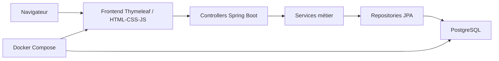

# Jour 1 - Cadrage de GameNest

## Objectif

Définir clairement le périmètre fonctionnel et technique de `GameNest` afin de lancer le projet sur des bases simples, réalistes et cohérentes avec le délai de 10 jours.

## 1. Fonctionnalités principales

### Fonctionnalités côté visiteur

- consulter les sorties à venir
- consulter les sorties déjà passées
- afficher la fiche détaillée d'un jeu
- voir des jeux similaires depuis une fiche jeu
- rechercher un jeu par titre
- filtrer les jeux par genre ou plateforme
- consulter une rubrique d'articles gaming

### Fonctionnalités de gestion

- ajouter un jeu
- modifier un jeu
- supprimer un jeu
- ajouter un article
- modifier un article
- supprimer un article

### Hors périmètre pour la V1

Pour rester faisable sur 10 jours, on ne traite pas dans la première version :

- authentification utilisateur
- comptes et favoris
- commentaires
- système d'avis
- récupération automatique d'articles depuis une API externe
- moteur de recommandation complexe

## 2. Backlog fonctionnel

### Priorité haute

1. En tant que visiteur, je veux voir les jeux à venir pour suivre les prochaines sorties.
2. En tant que visiteur, je veux voir les jeux déjà sortis pour parcourir le catalogue.
3. En tant que visiteur, je veux consulter la fiche détaillée d'un jeu.
4. En tant que visiteur, je veux voir des jeux similaires pour découvrir d'autres titres.
5. En tant qu'administrateur technique, je veux gérer les jeux avec un CRUD complet.
6. En tant qu'administrateur technique, je veux gérer les articles avec un CRUD simple.
7. En tant qu'évaluateur, je veux lancer le projet avec Docker Compose facilement.

### Priorité moyenne

1. En tant que visiteur, je veux rechercher un jeu par nom.
2. En tant que visiteur, je veux filtrer les jeux par genre et plateforme.
3. En tant que visiteur, je veux une interface propre et responsive.
4. En tant que développeur, je veux des données d'exemple pour la démonstration.

### Priorité basse

1. En tant que visiteur, je veux trier les jeux par date.
2. En tant que visiteur, je veux relier des articles à un jeu précis.
3. En tant que développeur, je veux ajouter des tests d'intégration complémentaires.

## 3. Stack technique choisie

### Backend

- `Java 21`
- `Spring Boot 3`
- `Spring Web`
- `Spring Data JPA`
- `Bean Validation`

### Base de données

- `PostgreSQL 16`

### Frontend

- `Thymeleaf`
- `HTML`
- `CSS`
- `JavaScript`

### Build / tests

- `Maven`
- `JUnit 5`

### Conteneurisation

- `Docker`
- `Docker Compose`

## 4. Pourquoi cette stack

- `Spring Boot` valorise clairement la partie Java.
- `PostgreSQL` est standard, robuste et simple à brancher à Spring.
- `Thymeleaf` évite la complexité d'un frontend séparé et permet d'aller vite.
- `Docker Compose` permet de démontrer une vraie orchestration application + base de données.
- `Maven` et `JUnit` sont des choix classiques, faciles à expliquer pendant la soutenance.

## 5. Répartition des tâches

### Membre 1 - focus Java

Responsabilités :

- création du projet Spring Boot
- modélisation des entités
- création des repositories
- création des services métier
- création des controllers
- logique de jeux similaires
- validation des formulaires
- tests backend

### Membre 2 - focus Docker et intégration

Responsabilités :

- création du `Dockerfile`
- création du `docker-compose.yml`
- configuration PostgreSQL
- gestion des variables d'environnement
- chargement de données d'exemple
- vérification du lancement complet du projet
- documentation d'installation

### Travail partagé

- intégration HTML/CSS/JS
- tests manuels
- corrections de bugs
- préparation de la démo finale

## 6. Arborescence cible du projet

```text
GameNest/
├── README.md
├── docker-compose.yml
├── .env.example
├── docs/
│   └── jour-01-cadrage.md
├── backend/
│   ├── pom.xml
│   ├── Dockerfile
│   └── src/
│       ├── main/
│       │   ├── java/com/gamenest/
│       │   │   ├── controller/
│       │   │   ├── service/
│       │   │   ├── repository/
│       │   │   ├── model/
│       │   │   ├── dto/
│       │   │   └── GameNestApplication.java
│       │   └── resources/
│       │       ├── templates/
│       │       ├── static/
│       │       ├── application.properties
│       │       └── data.sql
│       └── test/
└── database/
    └── seed/
```

## 7. Schéma simple de l'architecture



## 8. Entités principales

### `Game`

Champs proposés :

- `id`
- `title`
- `slug`
- `description`
- `releaseDate`
- `coverImageUrl`
- `studio`
- `publisher`
- `status`

Rôle :

- représenter un jeu vidéo dans le catalogue

### `Genre`

Champs proposés :

- `id`
- `name`

Rôle :

- classer les jeux par type

### `Platform`

Champs proposés :

- `id`
- `name`

Rôle :

- identifier les supports d'un jeu

### `Tag`

Champs proposés :

- `id`
- `name`

Rôle :

- aider la recherche et le calcul des similarités

### `Article`

Champs proposés :

- `id`
- `title`
- `summary`
- `sourceName`
- `sourceUrl`
- `publishedAt`

Rôle :

- stocker les liens vers des articles gaming

## 9. Relations principales

- un `Game` peut avoir plusieurs `Genre`
- un `Game` peut avoir plusieurs `Platform`
- un `Game` peut avoir plusieurs `Tag`
- un `Article` peut être global ou lié à un `Game`

Pour le MVP, la similarité pourra être calculée avec un score simple basé sur :

- les genres communs
- les plateformes communes
- les tags communs
- la proximité du style ou de la catégorie

## 10. Décision finale de cadrage

Le projet sera un site web monolithique :

- backend `Spring Boot`
- vues serveur `Thymeleaf`
- persistance `PostgreSQL`
- exécution via `Docker Compose`

Ce choix est le plus rentable pour :

- montrer une vraie architecture Java
- garder un projet faisable en 10 jours
- valoriser à la fois Java et Docker

## 11. Livrables de l'étape

- backlog fonctionnel priorisé
- stack technique validée
- architecture générale définie
- répartition des rôles proposée
- arborescence cible du projet
- entités principales identifiées
